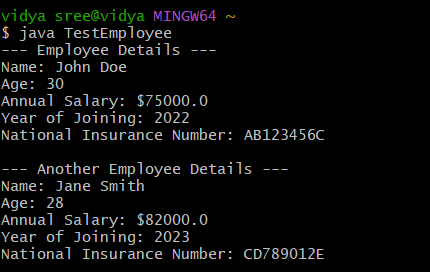

# java-lab-cse-g-5ef-4a
Experiment-4a
## EXPERIMENT 4A 
# implementation single inheritance 
source code 
java 
```
(person.java)

 class Person {
    String name;
    int age;
     public Person(String name, int age) {
        this.name = name;
        this.age = age;
    }
    public void displayPersonDetails() {
        System.out.println("Name: " + name);
        System.out.println("Age: " + age);
    }
}
(Employee.java)

public class Employee extends Person {
    double annualSalary;
    int yearOfJoining;
    String nationalInsuranceNumber; public Employee(String name, int age, double annualSalary, int yearOfJoining, String nationalInsuranceNumber) {
     super(name, age);
 this.annualSalary = annualSalary;
  this.yearOfJoining = yearOfJoining;this.nationalInsuranceNumber = nationalInsuranceNumber;
    }
    public void displayEmployeeDetails() {
displayPersonDetails();
 System.out.println("Annual Salary: $" + annualSalary);
System.out.println("Year of Joining: " + yearOfJoining);
System.out.println("National Insurance Number: " + nationalInsuranceNumber);
    }
}

(TestEmployee.java)
public class TestEmployee {
 public static void main(String[] args) {
 Employee emp1 = new Employee("John Doe", 30, 75000.0, 2022, "AB123456C");
        System.out.println("--- Employee Details ---");
        emp1.displayEmployeeDetails();
        System.out.println("\n--- Another Employee Details ---");
        Employee emp2 = new Employee("Jane Smith", 28, 82000.0, 2023, "CD789012E");
        emp2.displayEmployeeDetails();
    }
}

```

